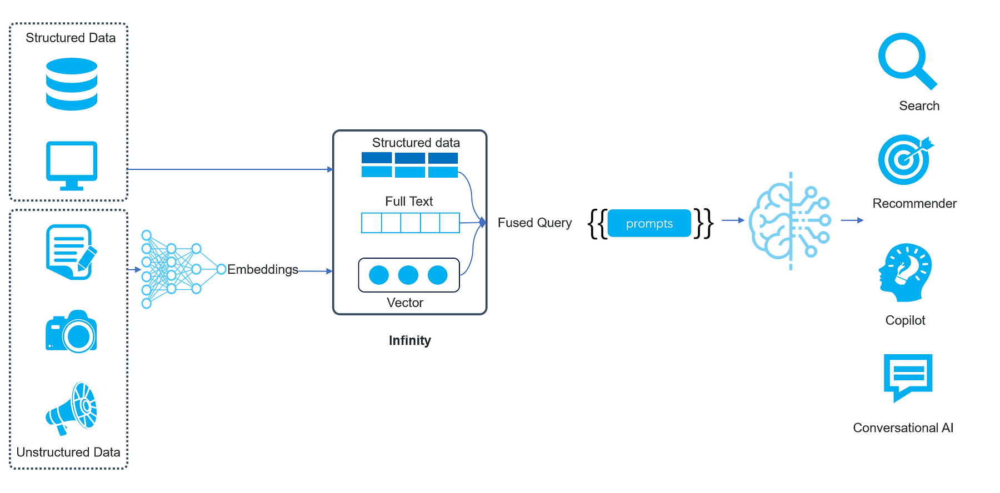

On January 4, 2024, CMU professor Andy Pavlo, known for his acclaimed database lectures, published his 2023 database review, primarily focusing on the rise of vector databases. 2023 saw notable advancements in this field with significant investments made in April. By 2023Q3, vector databases were used as external memory for large language models. In 2023Q4, this approach started to gain popularity and became widely known as Retrieval-Augmented Generation (RAG), with some even predicting that 2024 would be the "Year of RAG." Drawing from Andy's viewpoints and the challenges facing RAG, we would like to provide our own evaluation of the future prospects for vector databases.<!--truncate-->

## The rise of RAG and vector databases

RAG was initially employed to tackle some innate challenges in LLM. As the popularity of LLM grew, there was an increasing demand to utilize it to respond to queries from private or proprietary datasets. However, depending entirely on LLM would give rise to three concerns:

1. How can we guarantee "real-time" answers if all updates to the private data need to be fed into LLM for training?
2. How do we reduce the substantial expenses associated with feeding everything into LLM for training or fine-tuning?
3. How can an LLM effectively handle queries if user data exceeds its limited context tokens?

A typical approach of RAG for querying private datasets involves several steps. First, the private data is divided into small chunks, which are then converted into embeddings (vectors) by a embedding model. These embeddings are subsequently stored in a vector database. An incoming query will be converted into an embedding by the same embedding model. Then a similarity search is performed within the vector database to retrieve the top K results. These results are combined into prompts and fed to the Large Language Model (LLM) as input. The diagram below illustrates the workflow:

RAG's emergence quickly boosted the popularity of vector databases in the first half of 2023, as people saw their ability to address the aforementioned concerns. The proposed RAG ecosystem included three essential components: LLM for improving the final answer or abstracts, vector database for storing data, and middlewares like Langchain and LlamaIndex for chunking documents, transforming embeddings, connecting to the vector database and LLM, and concatenating prompts. However, the relatively low bar for implementing a basic vector search sparked heated discussions about vector databases:

- "To achieve basic RAG functionality, a similarity search library like FAISS can fit the purpose and can be readily deployed. A vector database is essentially built upon FAISS, then what else sets the 'bar' for a vector database?"
- "If cloud-native vector databases can lower the incurred costs, why not integrate vector capabilities directly into traditional databases? It's straightforward! For example, pgvector could effortlessly enable vector search in PostgreSQL, and incorporating vector search functionality into traditional databases is mainly about introducing a new data type, which can be finished within one or two months at most."
- "An LLM can increase its token limits. For example, streaming LLM claimed to be able to handle millions of tokens. If a powerful LLM could make a vector database unnecessary, then RAG is merely a temporary solution until LLM reaches its full potential."

These concerns appear plausible, whereas the proponents of vector databases failed to present a compelling argument. They focused solely on highlighting the performance of vector indexes, support for large-scale vector queries, and user-friendliness, bla bla bla, without providing a substantial viewpoint. Furthermore, as RAG is increasingly employed in diverse scenarios, more issues are surfacing:

1. Vectors lack the ability to convey precise information. In neural networks, a multi-dimensional vector is used to represent real-world objects, such as words, text passages, images, audio or video clips, and more. However, vectors can only capture semantic relationships and cannot represent specific words in an accurate manner. For example, either a single word or an entire article can be expressed using a single vector, making it impossible to capture specific words with vectors. In real-world scenarios, precise recall is crucial for most applications. For instance, the need to use LLM to provide precise answers, summaries, or abstracts based on specific manuals, contracts, financial reports, etc.
2. Since any text can be represented as a vector, how is the mapping between texts and vectors established? Due to the inconvenience of maintaining such mapping relationships, many RAG applications remain limited to personal use and cannot be applied in real enterprise settings.

Because RAG didn't perform well in many real enterprise settings and it's beyond the capability of the existing vector databases to solve these issues, the debate surrounding vector databases gradually became lost in the discourse of "To RAG, or to fine tune".

Now, let's peel off the veneer and delve into what exactly RAG needs. First and foremost, we contend that RAG is an evolution of search engines in the age of LLM.

## RAG and search engines

A search engine is one of the earliest forms of artificial intelligence. Whether it's a web search engine or an enterprise search engine, it operates similarly to an LLM: a web search engine creates an inverted index on Internet data gathered from web scrapers; an enterprise search engine builds an inverted index on data from internal sources. When a user enters a query, it is first broken down into multiple keywords, and then the inverted index returns the top K preliminary results. These preliminary results are ranked based on specific factors such as PageRank in a web search engine or document word frequency statistics like TF/IDF in an enterprise search engine. Following this "initial" ranking, there are rounds of further re-ranking, often involving machine learning models trained on user click logs from previous queries and corresponding results. In personalized search, user clicks and search preferences are also taken into account. The re-ranked results are still original data, but, after multiple rounds of ranking, they are ultimately sorted in a descending order of user preference.

An LLM is a generative model that generates the ultimate answer to a query, as opposed to just the top K results. If the user's query is a question, then the response from LLM compares to a summary of the top K results from a search engine, saving users from the trouble of sifting through the original data and notably enhancing the search experience. LLM is also capable of tasks other than question-and-answer, such as reasoning, code generation, and cross-modal content generation, but RAG primarily focuses on question-and-answer. RAG allows LLM to serve enterprise scenarios, but it still needs to address challenges previously addressed by traditional enterprise search engines, such as accessing proprietary and real-time data, and returning content based on permissions…

Furthermore, RAG follows a similar process to a search engine but differs in two core aspects: one being the use of inverted index versus the use of vector index, and the other being that RAG utilizes LLM to generate the final answer from the returned top K results.

For the first aspect, an inverted index employed by a search engine essentially establishes mapping between terms and the documents containing these terms. User questions in the corresponding queries are converted to a set of keywords, and the final results are retrieved from the index. Though built for precise recall, inverted indexes can hardly establish strong semantic relationships, as they simply represent mappings of keywords. Whereas in a vector database, it's much easier to use vectors to find results with similar semantics to a given query, because a sentence can be represented as one or more vectors and because it is only required to identify the top K vectors nearest to the query vector.

For the second aspect, search engine results typically consist of the top K original texts after multiple rounds of ranking and re-ranking. Users must then sift through these texts to find the actual answer. An LLM with RAG architecture directly provides the final answer based on semantic search results. So to speak, RAG's primary strength lies in its ability to abstract from the top K query results and minimize hallucinations by limiting LLM inputs. RAG represents an evolution of enterprise search engines in the age of LLM. Let's examine a few examples:

**Vespa**: A longstanding open-source search engine. Vespa's history can be traced back to the 1990s as it was preceded by the search engine Overture, which Yahoo acquired in 2003. In October 2023, Vespa became independent from Yahoo and secured $31 million in funding from Blossom. Its notable funding venture involves a large-scale RAG that leverages Internet data to deliver reliable question-and-answer services to end users.

**Baichuan**: Recently, Baichuan unveiled its Turbo API, which is built on RAG. Its backend uses technologies that enhance the effectiveness of RAG, including query expansion, multiple-recall, and ranking, all of which demonstrate their strengths in the area of search engine. As the successor of Sogou, a renowned Internet search engine, Baichuan's shift towards offering RAG services feels like a natural progression.

**Perplexity.ai**: One of the most successful RAG applications for end users. It is also an evolution of a search engine but goes beyond the scope of a conventional search engine by doing the following:
- Utilizing LLM to better understand and parse user questions into clearer search queries.
- Utilizing APIs from search engines like Google and Bing, Perplexity.ai has created its own domain-specific indexes to ensure search quality.
- Employing proprietary ranking algorithms to re-rank all search results and filter out multiple high-quality web pages.
- Utilizing LLM to read the re-ranked web pages and generate answers to the given questions.

## Core requirements of RAG

By assessing RAG applications across various sectors and distilling their best practices, we conclude that the fundamental requirements of RAG can be condensed into the following three:

1. Obtaining better vectors with better embedding models: Before storing in the database, it is crucial to preprocess the text adequately and perform proper text chunking to ensure the vectors obtained are suitable.
2. Multiple-recall: Only multiple-recall can support both semantic search and precise recall, and the latter is essential in enterprise search. A RAG sans precise recall is bound to fail in most enterprise scenarios.
3. Ranking (cross-attentional re-ranking): The term "cross-attentional" relates to multiple-recall. The outcomes of multiple-recall also require effective re-ranking (fused ranking) to feed the LLM with the most appropriate inputs.

Among RAG's three fundamental requirements, aside from vector transformation, the other two can be achieved within the database. Multiple-recall and ranking essentially constitutes a more advanced search engine, which combines vector search and full-text search. Traditional databases are insufficient in effectively supporting RAG because they lack the following components required by such a search engine:

- Efficient full-text indexing.
- Diversified ranking approaches.
- Ubiquitous natural language processing.

Let's take PostgreSQL, an OLTP (Online Transaction Processing) database, as an example. The design goal of an OLTP database is to ensure ACID compliance for data writes. However, this goal does not pertain to vector search or full-text search. Although PostgreSQL has supported full-text search for over a decade, enterprises still choose Elasticsearch for full-text search. The reason is that PostgreSQL's full-text search is only suitable for small-scale, simple searches. A database that natively supports RAG must be able to handle datasets of various scales, enable customizable relevance ranking, and implement multiple-recall (including vectors) for fused ranking. These tasks are beyond the capabilities of PostgreSQL. Therefore, neither vector databases alone nor traditional databases with added vector search capabilities are sufficient for RAG.

Alright. If a search engine like Elasticsearch provides support for multiple-recall capabilities (for both full-text and vector search), as well as RRF-based fused ranking, does that mean it can support RAG? Unfortunately, it is still not enough.

An enterprise search scenario typically involves various data sources. Let's consider a straightforward task, which is to find appropriate answers based on permissions and feed them to LLM for the final results. This requires mapping the permission field from a separate table to a collection in Elasticsearch, involving three things:

- A high-cost ETL is introduced for simple requirements.
- Updates to the raw permission data will not be reflected in the response of the LLM.
- Unnecessary data inflation is introduced. Permission filtering is merely one example. Depending exclusively on ETL to handle various queries from multiple data sources is like keeping a wide table with all filtering fields. This approach not only presents difficulties in terms of system maintenance and data updates, but also leads to unwarranted data inflation. Typically, a wide table is required only for offline data lakes in enterprise scenarios.

Therefore, a decent enterprise RAG solution should revolve around a fully functioning database, accompanied by supportive tools like efficient text chunking and embedding models, and particularly tailored business-optimized fused ranking models. Elasticsearch has been around as an enterprise search engine for over a decade. A prominent technical distinction between Elasticsearch and a typical database is that it lacks an execution engine. Instead, when receiving a query request, Elasticsearch retrieves data using the inverted index and returns the results after ranking, all within a single thread. In contrast, a query in an execution engine is compiled into a computational DAG (Directed Acyclic Graph), and then the data flows through the graph in a pipeline. The execution engine dynamically determines the parallelism for each node in the graph based on available resources. Due to the lack of an execution engine, Elasticsearch falls short of supporting enterprise scenarios requiring precise recall from various data resources.

## Future of RAG

Now, having addressed the majority of concerns regarding vector databases, we will continue to emphasize the following viewpoints. Although these perspectives may seem insignificant, they can still impact people's perceptions.

1. It's impractical to overestimate large context tokens in a model. Rather, RAG operates by narrowing the context window. According to its error log, GPT4 Turbo, released by OpenAI on November 6, 2023, utilizes a vector database like Qdrant and essentially functions as a RAG. Using a vector database in RAG may be adequate for end-user scenarios, as in OpenAI's case. streaming LLM is an example with nearly limitless context tokens. However, it doesn't truly address the bottleneck caused by the limited capacity of KV cache during inference. Instead, it uses a sliding window to retain the most recent attention. In essence, even if an entire book can be placed into LLM and questions asked, LLM can only remember the most recent content. Therefore, we shouldn't dismiss RAG simply because LLM supports more context tokens. Context tokens at a million scale equate to a few gigabytes, whereas in enterprise scenarios, data easily reaches gigabytes or terabytes. Furthermore, precise recall on large volumes of data, such as permission-based queries, is always an inevitable consideration. In this sense, RAG is not a temporary solution and will endure in the long run.
2. The current bottleneck of RAG is actually LLM itself. The biggest pain point in using LLM is not the limited context tokens but its inability to address hallucinations even with limited context tokens.

As shown in the following diagram, the future RAG will include an LLM and a dedicated database that supports it: The LLM acts as the portal to different online enterprise applications, whilst the dedicated database, which we call as AI-native database, manages the data from multiple resources.

- Data that can be effectively represented as vectors will be transformed into vectors.
- Data that can't be converted to vectors, like various structured and semi-structured data, will be stored in their original format.
- Queries won't be limited to using a single vector to retrieve similar vectors. Instead, a single query will encompass multiple search criteria, including vector search (with multiple vectors in a query), full-text search, structured data search, as well as multiple-recall for various queries.

The above is also the original intention behind the development of the AI-native database Infinity, which was open-sourced before the winter solstice of 2023. It is a brand-new database developed specifically to address the pain points of RAG. It introduces multiple-recall, fused ranking, and structured data query.

Revisiting Andy's 2023 annual review, Andy and Weaviate's CTO discussed the future paths of vector databases. One path is for vector databases to support traditional DBMS functionalities, such as support for operational/online workloads. The alternative path is to function as an index database alongside the upstream database, similar to Elastic or Vespa. Infinity actually combines both aspects: it serves as an advanced search engine with all necessary capabilities for RAG, and it also possesses database functionalities such as an execution engine to support diversified access requirements in enterprise scenarios, setting it apart as a third-generation database infrastructure tailored for AI:

- The initial phase of AI relies on data statistics and mining and features the search engine. Elasticsearch and databases like MySQL were commonly used as infrastructure supporting enterprise AI applications.
- The second phase of AI brought deep learning, which led to vector search and the rise of vector databases. But because vector databases are only capable of vector search, they need to collaborate with various databases to create what is known as AI PaaS.
- In the latest phase, with the arrival of LLMs, numerous new opportunities have emerged. A vector database alone is insufficient to handle the demands of these scenarios. We now need an infrastructure that can perform vector search, full-text search, and structured data retrieval simultaneously. It must also support retrieval of complex data for LLMs to better serve enterprise scenarios.

Here's our assessment of the future of RAG and vector databases, along with our rationale for creating an AI-native database from scratch. If you're interested, feel free to follow our project: https://github.com/infiniflow/infinity/