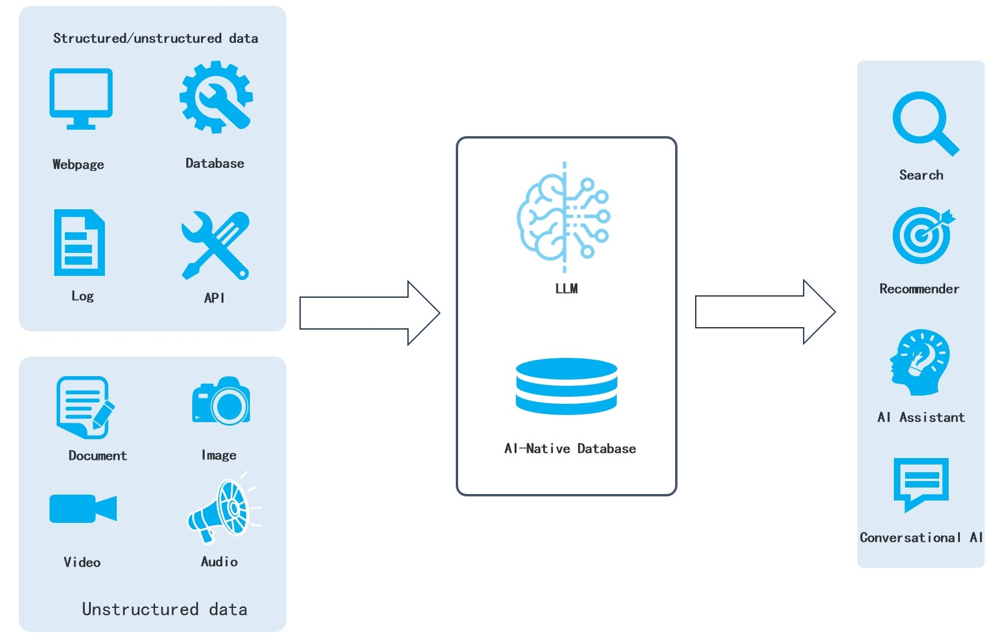

"Is Infinity just another vector database? Since there are already many vector databases available, why bother creating another one from scratch?" "Traditional databases can easily incorporate vector search capabilities, so why reinvent the wheel?" "Elasticsearch already has decent support for what you refer to as multiple recall. Then, what sets Infinity apart?" <!--truncate-->

[Infinity](https://github.com/infiniflow/infinity), the AI-native database, was made open-source prior to the winter solstice of 2023. Within just over two weeks, it has received positive feedback and accumulated 700+ stars from the open-source community. The above inquires are among the majority of the feedback.

Today, we will try to address these queries and delve into why the era of large models requires a fresh AI-native database.

Infinity is defined as an AI-native database primarily because it is designed to support Retrieval-Augmented Generation (RAG) applications. At first, RAG was not widely known and referred to as "knowledge base plug-ins", which seemed like a makeshift solution. People thought that the advancement of Large Language Models (LLMs), such as by providing even higher token limits, would render such solutions unnecessary. However, recently, the term RAG regained popularity, with some even predicting that 2024 would be the "Year of RAG". Let's explore whether RAG will stand the test of time or if it's just a temporary solution in light of the continuous improvement of large models.

- No matter how powerful a Large Language Model (LLM) is, it can only substitute human learning and reasoning capabilities, but not the functions of data storage and data access. Even with an extensive set of parameters, an LLM is unable to accurately represent the vast and varied data within an organization solely through training on generic data, and processing such data is crucial for enterprise and private scenarios.
- No matter how an LLM evolves, in enterprise scenarios, it has to access various enterprise data sources, including documents, logs, and databases, as well as facing challenges associated with accessing these data, such as permissions, data cleaning, data storage, and cross-data-source queries. It is important to note that these challenges cannot be tackled by an LLM alone.

It is these facts that draw us to the conclusion that RAG will exist in the long run and that the core database system empowering RAG must also undergo consistent upgrades and iterations to keep pace with the evolution of RAG. It is precisely for this reason that we initiated the development of Infinity.

## Architecture of a RAG

We believe that RAG will be built around an AI-native database, as illustrated in the architecture diagram below:

In this architecture diagram:

- Data that can be effectively represented as vectors will be transformed into vectors.
- Data that can't be converted to vectors, like various structured and semi-structured data, will be stored in their original format.
- Queries won't be limited to using a single vector to retrieve similar vectors. Instead, a single query will encompass multiple search criteria, including vector search (with multiple vectors in a query), full-text search, structured data queries, as well as multiple recalls for various queries.

Therefore, RAG requires a flexible database with aforementioned capabilities, rather than a database that is only capable of searching vectors. This brings us back to the earlier question: Why develop a new database when we could merely add vector search capabilities to an existing one?

## Core requirements of a RAG

After the RAG regained popularity, numerous articles have emerged discussing how to improve its performance. Yes, the ability to provide better question-answering responses is perhaps the main concern for anyone working on RAG projects. Most of the techniques mentioned in these articles revolve around building a simple RAG system using open-source vector database or a conventional database with built-in vector capabilities, along with middleware tools like Langchain and LLMOps. While these "quick setups" may only serve as toys or prototype demonstrations in many scenarios, we can still observe that all these techniques aim to address the three fundamental requirements of RAG:
1. Obtaining better vectors with refined embedding models: Sufficient preprocessing of the text is required before feeding it into the database, and proper text segmentation is also crucial to ensure that the obtained vectors are appropriate.
2. Multiple recalls: Indeed, the significance of multiple recall for RAG cannot be overstated.
3. Ranking (cross-attentional re-ranking): The term "cross-attentional" refers to multiple recall. The outcomes of multiple recall also require effective re-ranking (fused ranking) to provide the LLM with the most appropriate inputs.

## Unresolved Challenges in RAG: Multiple Recalls and Sorting

Among RAG's three main requirements, apart from the vector transformation mentioned earlier, the remaining two can be accomplished within the database itself. Therefore, why not utilize a database that has vector capabilities? The reason is that executing these two tasks effectively has consistently proven challenging. Despite search engines being in existence for over two decades, no company relies solely on a database to construct either Internet search engines or vertical search engines in the 2C realm, or enterprise search engines in the 2B sector. To succeed in RAG, organizations must possess core competence in building search engines, as RAG is essentially the evolution of a search engine. Let's examine a few examples:

**Vespa**: An open-source search engine with a long history. Vespa's roots can be traced back to the 1990s as it was preceded by the search engine Overture, which Yahoo acquired in 2003. In October 2023, Vespa gained independence from Yahoo and secured $31 million in funding from Blossom. Its notable funding venture involves a large-scale RAG that leverages Internet data to deliver reliable question-and-answer services to end-users.

**Baichuan**: Recently, Baichuan unveiled its Turbo API, which is built on RAG. Its backend uses technologies that enhance the effectiveness of RAG, including query expansion, multiple recall, and ranking, all of which demonstrate their sheer technical strength in search engine development. As the successor of Sogou, a renowned internet search engine, Baichuan's shift towards offering RAG services feels like a natural progression.

**perplexity.ai**: One of the most successful RAG applications for end-users. It is also an evolution of a search engine but goes beyond the scope of a conventional search engine by doing the following:

- Utilizing Language Model (LLM) to better understand user questions and parse them into clearer search queries.
- Utilizing APIs from search engines like Google and Bing, perplexity.ai has created its own domain-specific indices, ensuring search quality.
- Employing proprietary ranking algorithms to re-rank all search results and filter out multiple web pages of good quality.
- Utilizing LLM to read the sorted web pages and generate answers relevant to the given questions.

In summary, conventional databases are unable to effectively meet the needs of RAG due to the absence of essential components required by search engines. These components include:

- Efficient full-text indexing.
- Diversified ranking approaches.
- Ubiquitous natural language processing.

And these are exactly the issues that Infinity has targeted and worked to tackle right from the start. Unlike the above large-scale RAG systems that cater to Internet search scenarios, Infinity is specifically designed for enterprise scenarios. Just like internet search or vertical search will transform into the aforementioned applications, enterprise search will inevitably evolve into a form of enterprise RAG. This is a challenge that can't be resolved by conventional databases combined with vector search capabilities.

## Infinity vs. Elasticsearch

One final question: Elasticsearch is now widely used in enterprise searches and is capable of vector search and multiple recall. What differentiates Infinity from Elasticsearch?

Before answering this question, let's address another: Can Elasticsearch cater to the mentioned RAG applications? This question echoes one posed a decade ago, "Can Elasticsearch meet the requirements of vertical search?" The answer, without a doubt, is affirmative; however, in a basic capacity. The famous quote from the search engine era, "Relevance is Revenue", still holds true in the realm of RAG. Numerous query expansions and ranking adjustments are necessary to align with business demands, and relying solely on Elasticsearch falls short of meeting those requirements.

Because ranking primarily revolves around rules such as TF/IDF, there were limited possibilities for document ranking in traditional enterprise searches: unlike PageRank with web pages, there were no weightings for document ranking within enterprise; there was no user feedback available to continuously improve search ranking results. However, apart from TF/IDF, current RAG applications can utilize various embedding models to improve recall and ranking. As a result, enterprise RAG applications are now more closely aligned with RAG applications used by Internet users. The differences between the two are no longer as distinct as those between traditional enterprise search and internet search in the past.

A well-designed RAG system requires a core database and auxiliary AI tools, particularly fused ranking models tailored to vertical businesses and enterprises, to ensure satisfactory results. Infinity has prioritized DB4AI from the design stage, and as the core capabilities of the database improve, a series of AI features supporting RAG applications will follow.

Second, Infinity was developed following a comprehensive database architecture, with a strong focus on three core capabilities: vector search, full-text search, structured data queries, and their corresponding fused ranking. In contrast, Elasticsearch emerged as an enterprise search engine over a decade ago. A prominent technical distinction between the two is that Infinity incorporates an execution engine: When receiving a query request, the execution engine compiles it into a computational DAG (Directed Acyclic Graph), and the request flows through the graph in a pipeline. The engine dynamically determines the parallelism for each node in the graph based on available resources. On the other hand, search engines like Elasticsearch do not have an execution engine. They directly retrieve data using the inverted index and return the results after ranking, all within a single thread.

The lack of an execution engine means that it cannot serve enterprise scenarios requiring diversified precise information retrieval. One common scenario is access with permissions, which requires accessing permission tables, business tables, and dimension tables, as well as multiple recall. Without being able to serve general queries on structured data, even the simplest knowledge base would require an additional permission database for federated queries. It may even need to be transformed into a wide table through ETL (Extract Transform Load) for applications. However, in a high-concurrency, online scenario, introducing wide tables is unnecessary and unacceptable. Therefore, Infinity is not developed as a search engine but a fully-fledged database. While not necessary for RAG applications in the 2C realm, it is essential for enterprise RAG applications.
Furthermore, we have to stress the importance of performance. As a database developed using the C++20 standard, Infinity made performance its top priority right from the start. It does not suffer from the various fluctuations and memory issues that come with constructing Infras using garbage collection (GC) programming languages. The open-source version of Infinity presently outperforms all known open-source vector databases when it comes to vector search.

Finally, in 2024, Infinity will introduce a cloud-native architecture, which will also differentiate it significantly from Elasticsearch.

This is our response to why we chose to develop a new database for RAG. Interested readers are welcome to star and follow our project: https://github.com/infiniflow/infinity/