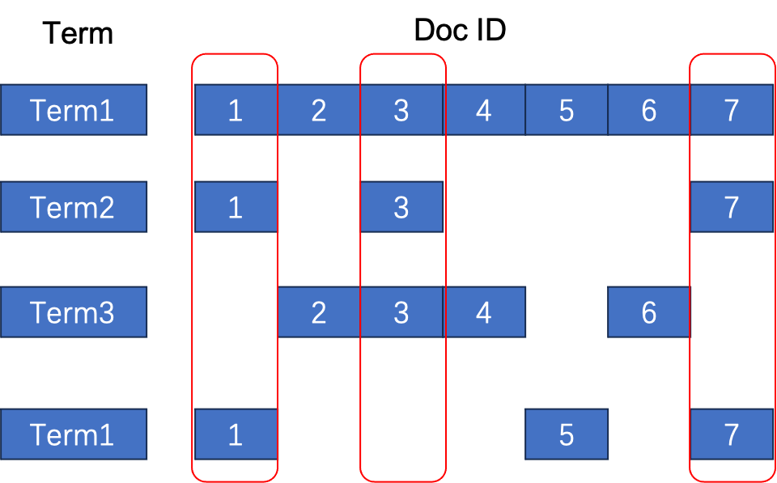
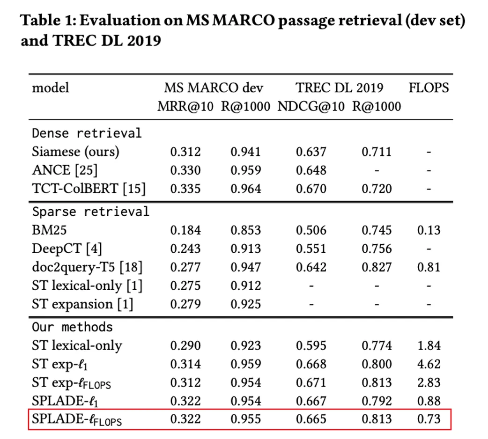

Since the open-sourcing of Infinity, it has received a wide positive response from the community. Regarding the essential RAG technology we promote - multiple recall (vector recall, full-text search, and structured data query), some friends mentioned that simply using vectors can also meet the requirements. What we traditionally refer to as vector retrieval is a type of query based on dense vector data, known as Dense Embedding. There is another type of vector data, sparse vector, known as Sparse Embedding, which can provide the precise queries necessary for RAG. By combining these two types of vector data, multi-path recall can be achieved (2 paths of recall). With Sparse Embedding, there is no need for full-text search; BM25 can be completely replaced (BM25 is a common full-text indexing and sorting method, which can be seen as a variation of TF/IDF). Let's see if this is really possible. Dense Embedding refers to vectors where the dimensions may not be very high, but each dimension is numerically represented as a certain weight. Sparse Embedding refers to most dimensions of the vector being zero, with only a few dimensions having values; the overall vector dimension can be very high.<!--truncate--> For example, in the two examples below, the top one is Dense Embedding, and the bottom one is Sparse Embedding. Since most dimensions have no values, the form (position, value) can be used to express each dimension with a weight in the vector.

```
[0.2, 0.3, 0.5, 0.7,......]
[{ 331 : 0.5 }, { 14136 : 0.7 }]
```

Sparse Embedding is used for precise recall, and even multiple recall, and most well-known vector databases have it, which can be seen in the references [1–3] at the end of the article. Simply put, a sparse vector refers to a vector with a high dimension, for example, with 30,000 dimensions, where each dimension represents a word. A dedicated Embedding model is used to project documents onto a sparse vector, aligning this sparse vector with the document's language vocabulary. Subsequently, retrieval strategies are executed on the word dimension, which can achieve precise recall. From this perspective, sparse vectors are similar to the inverted index of full-text search, as shown in the simple inverted index below. If we look at the inverted index by column, each column represents a list of words contained in a document, which is essentially a sparse vector. The three red boxes in the diagram represent three different sparse vectors for document IDs 1, 3, and 7. The inverted index provides an efficient retrieval method for sparse vectors.




The Embedding model that generates sparse vectors is different from the Embedding model that generates ordinary dense vectors. The latter projects documents into a dense vector that can only represent semantic relationships within the document. The former associates a specific dimension with a specific word, but cannot represent semantics. The so-called semantics can be most simply summarized as representing the probability of different words co-occurring in a context window - this calculation method was the earliest means of representing words and documents semantically. Current Embedding models build upon the concept of co-occurrence and address issues like representation robustness, but fundamentally, they are not different from the earliest semantic definitions.

On the other hand, the Embedding model that generates sparse vectors does not require this type of calculation. It focuses on how to further prune, expand, and define weights for words in the traditional Information Retrieval process based on the inverted index. A well-known and representative work in this field is SPLADE [4], which uses standard pre-training data to remove redundant terms from documents, add corresponding expansion terms, and generate a standard sparse vector output. The removal of redundant terms is akin to removing "stop words" in traditional search engine tokenization processes, while adding expansion terms is similar to traditional search engines' techniques for querying synonyms and expanding.

From a usage standpoint, it can represent any document as a 30,000-dimensional sparse vector, with each dimension indicating the weight of a specific word. In various Information Retrieval evaluation tasks, using SPLADE sparse vectors has shown significantly better recall performance compared to traditional search engines based on BM25 ranking, as shown in the figure.





So, can we say that with the use of sparse vectors is sufficient for multiple recall, while full-text search is no longer necessary? Let's take a look at the most representative sparse Embedding model, SPLADE:

SPLADE and similar works are the results of the continuous evolution of research in the field of information retrieval over the past decade. It is developed as follows: Firstly, a pre-trained language model such as BERT is used for warm start, two loss functions are added to the network, one is Ranking Loss used for ranking, and the other is a Regularization Loss to ensure sparsity, aiming to learn the weights for each word and words that can be used for expansion (akin to synonyms). SPLADE is trained using the Microsoft MSMARCO dataset, where the data is organized into "question: answer lists" using traditional search engine recall methods like BM25, and then manually annotated to prioritize more relevant answers at the top, totaling hundreds of thousands of such question-answer pairs. Therefore, we can observe the following:

1. SPLADE is a pre-trained model that utilizes existing language models trained on manually labeled search/sorting data to achieve the final results. Hence, on this data, SPLADE is definitely more effective than simple BM25.
2. However, we cannot conclude that SPLADE performs well in all tasks because in most cases, a company's own data domain is different from the data used to train SPLADE. Even though the data used to train SPLADE is generic, its generality is not extensive enough to cover all scenarios, given that this data is merely a dataset for academic research evaluation.
3. A good practice is for each company to use SPLADE in combination with their own data to train a proprietary sparse Embedding model. However, this approach presents two challenges: firstly, it significantly raises the complexity and cost of applying the RAG model to the company; secondly, acquiring training data is much harder than technical challenges.

In fact, when we mention full-text search within multiple recall, it is not simply a matter of using BM25 and being done with it. The following aspects are essential in specific recalls:

1. Industry specific dictionaries as well as industry-based query expansion. The weights of words vary in different contexts; for example, the weights of words in finance differ from those in law. Just as having Elasticsearch does not automatically mean the search results are good.
2. Recall and ranking are tasks that require customization, especially in the case of enterprise scenarios. For instance: The weights for different business fields will definitely be different, and these weights need to be defined flexibly; there are many special recall rules that need to be processed, such as wildcards and prefix queries, edit distance queries, phrase queries, and so on, each of which is required at different times. Some may say that the syntax for these queries is quite complex, doesn't it increase user's usage costs? Indeed, but in the implementation of an RAG system, these tasks are handled by the middleware of RAG, where users only need to ask questions in natural language, and the middleware converts these questions into query conditions that fit the intent. The database itself needs to provide as much customizability as possible to meet the diverse business scenarios.

In the field of information retrieval and search engines, utilizing Embedding for recall has been around for many years, and these Embeddings are obtained through the Learning to Rank (LTR) sorting learning mechanism. Therefore, for operating a search engine oriented towards consumers, receiving sufficient user feedback, coupled with adequate manual annotation, to generate datasets tailored to the company's needs is the best choice for improving service quality. However, even so, any search and conversation scenario aimed at consumer users combines various methods to produce results, including based on inverted indexes, page weights, sparse vectors, dense vectors, etc., and in the final Reranker re-ranking stage, similar mechanisms are employed to train a good enough sorting model to obtain the final ranking results. In enterprise scenarios, obtaining such data can be very challenging; the generalizability of Embedding models has not yet reached a sufficiently inclusive level. Therefore, the flexibility and customizability of the database itself will be crucial. Successfully implementing the database in the RAG scenario is not as simple as deploying a traditional database and handing it over to a Database Administrator (DBA). In RAG, there is no DBA; the application of data to specific scenarios and enterprises is both complex and of high value.

Returning to the title, Sparse Embedding or BM25? In fact, it is not a matter of choosing one over the other; the answer is clear, both are essential, and on their own, they are still not enough.

Stay tuned with [Infinity](https://github.com/infiniflow/infinity); we will continue advancing the open-source nature of databases and further implementing RAG in every enterprise.

## References

- https://qdrant.tech/articles/sparse-vectors/
- https://www.pinecone.io/learn/splade/
- https://weaviate.io/blog/hybrid-search-explained
- SPLADE v2: Sparse Lexical and Expansion Model for Information Retrieval, https://arxiv.org/abs/2109.10086, 2021