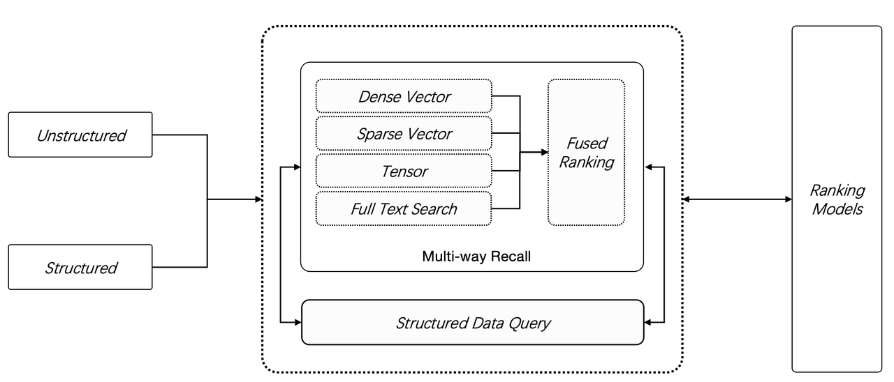
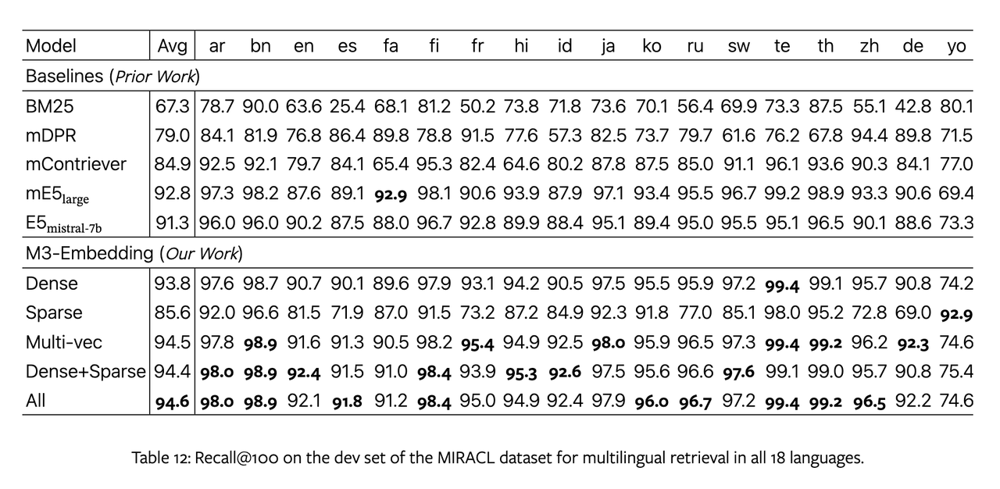
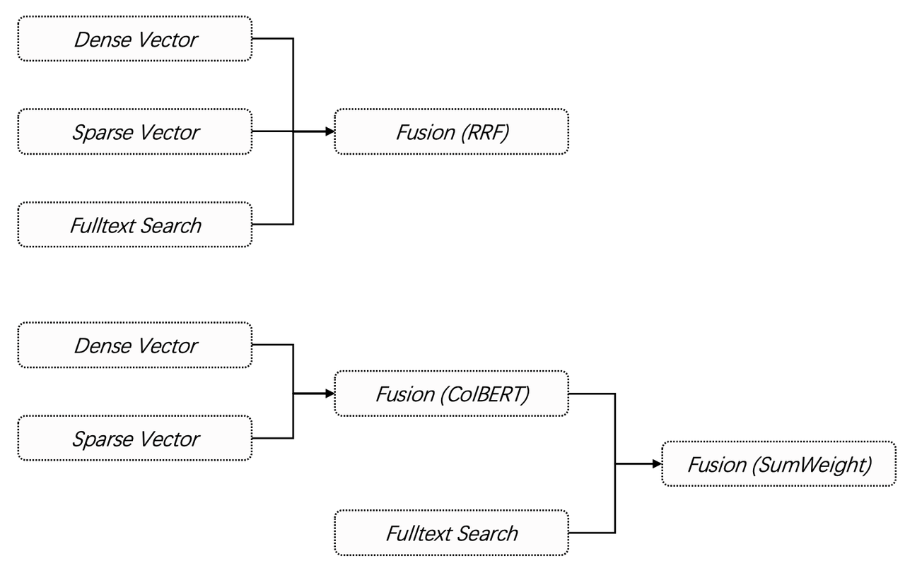
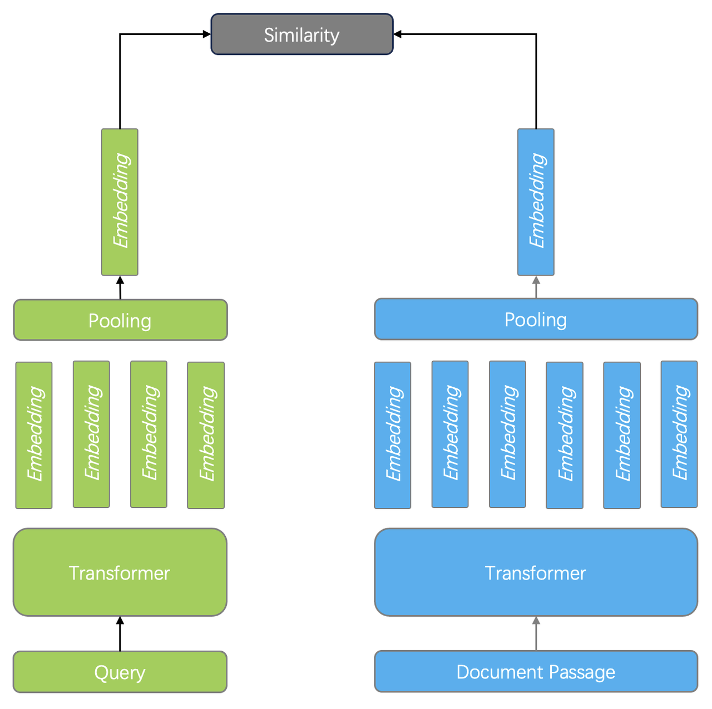
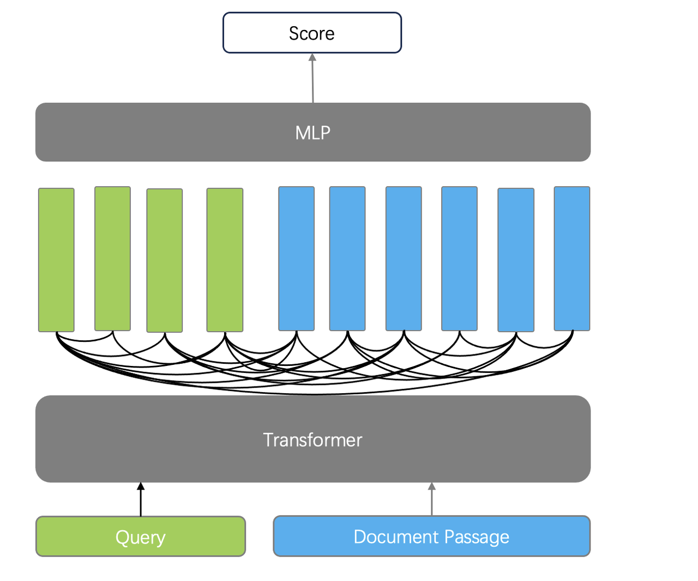
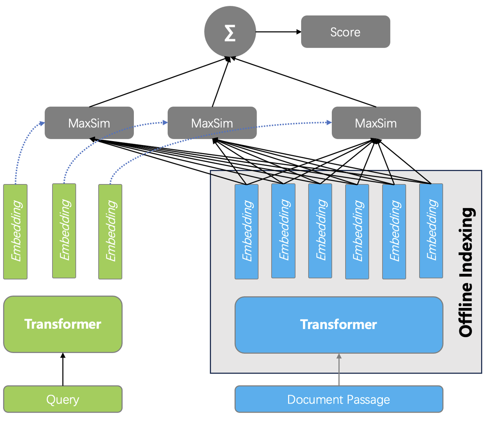
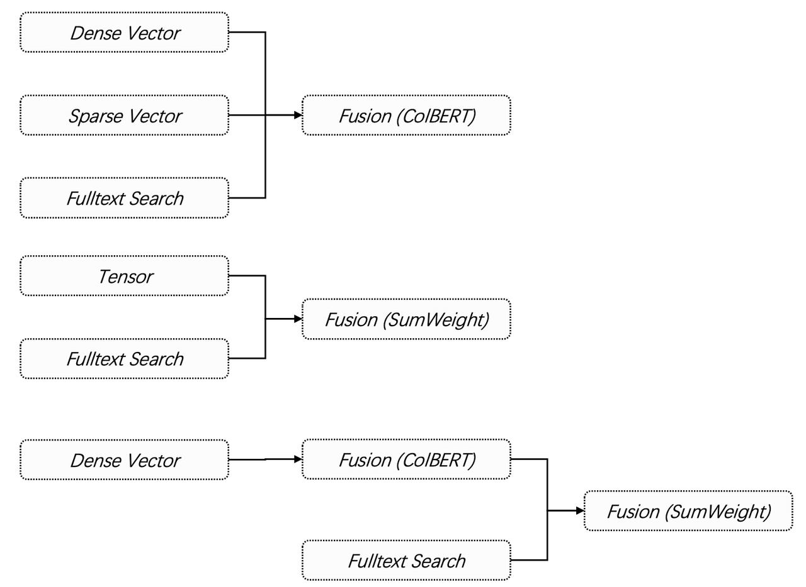
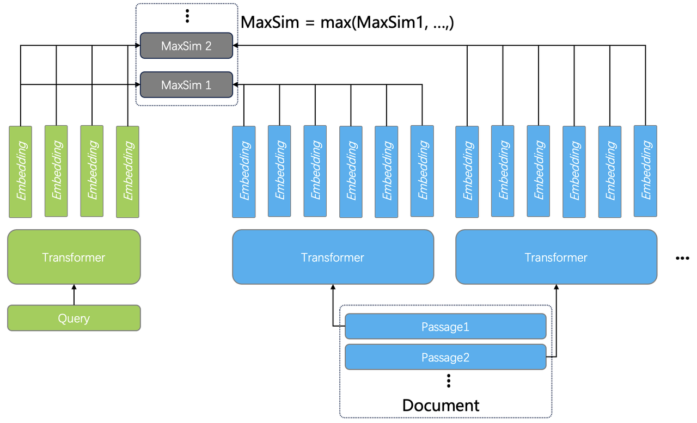
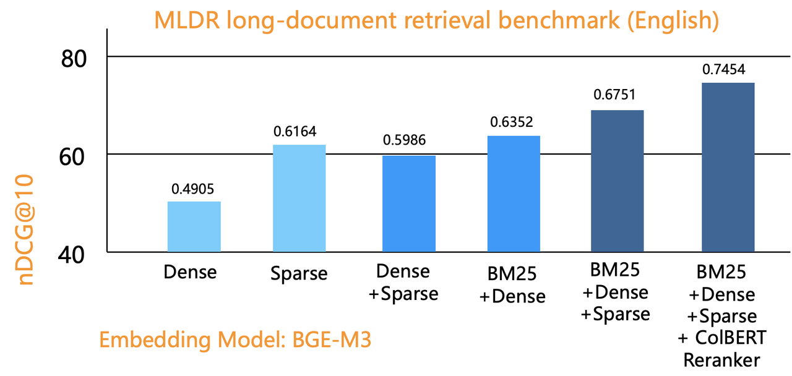

Infinity v0.2 was released, introducing two new data types: Sparse vector and Tensor. Besides full-text search and vector search, Infinity v0.2.0 offers more retrieval methods. As shown in the diagram below, users can now do retrieval from as many ways as they wish (N ≥ 2) in a hybrid search, making Infinity the most powerful database for RAG so far.<!--truncate--> 



## Why hybrid search (multi-way recall)?

There's a growing consensus that relying solely on vector search, typically dense vectors, may not always yield satisfactory results. This limitation becomes apparent when a user's specific query keywords do not precisely match the stored data. This is because vectors themselves cannot represent precise semantic information: A vector can represent a word, a sentence, a passage, or even an entire article. While used to convey the "meaning" of a query, this representation is sort of a probability that the query coocurs with other texts in a contextual window. Therefore, vectors are inadequate for precise queries. For instance, a user inquiring about the portfolios in their company's March 2024 financial plan might receive portfolios from a different time period, marketing or operational plans for the same period of time, or even other types of data.

Therefore, a more effective approach is to use keyword-based full-text search for precise recall and have it work in tandem with vector search. This combination of full-text and vector search is known as two-way recall or hybrid search.

Another approach is to introduce sparse vectors, combining them with dense vectors for hybrid search. Unlike dense vectors, sparse vectors are not a simplified representation of semantics, but they serve as an alternative to full-text search, aiming at pruning and expanding keywords and defining keyword weights for the inverted index vocabulary in a full-text search. This allows a document to be represented by sparse vectors composed of pruned keywords. In the following example, the first line represents a dense vector; the second line is a sparse vector. Sparse vectors typically have significantly higher dimensions than dense vectors, up to 30,000 dimensions. A position-value pair `{position: value}` can be used to indicate each weighted dimension in the sparse vector as most dimensions have no values.

```
[0.2, 0.3, 0.5, 0.7,......]
[{331: 0.5}, {14136: 0.7}]
```

SPLADE (reference [1]) is one of the most well-known and representative works for converting text into sparse vectors. It uses a standard pre-trained dataset to remove redundant terms from the document and add expansion terms, creating a 30,000-dimensional sparse vector output. 

The removal of redundant terms here resembles the "stopword removal" process seen in traditional search engines, where commonly occurring but non-informative words like "the" and "a" are removed during index building. This practice applies to the preprocessing of other languages as well without compromising retrieval efficiency. Likewise, the addition of expansion terms is similar to expansion techniques like synonyms seen in traditional search engines. 

In practical terms, any document can be represented with 30,000-dimensional SPLADE sparse vectors, with each dimension denoting the weight of a word. In typical information retrieval evaluation tasks, SPLADE sparse vectors have outperformed traditional search engines based on BM25 ranking. A recent research using the BGE M3 embedding model (reference [2]) validates that hybrid searches using both sparse vectors and dense vectors well surpassed BM25 in typical information retrieval evaluation tasks.



If it seems that dense vectors + sparse vectors prove a more effective solution for multiple recall (multi-way retrieval), then is it necessary to also have full-text search + dense vectors?

## Why three-way retrieval?

RAG still faces many unsolved issues and technical challenges, despite that the development of information retrieval theories provided it with significant support. Sparse vectors eliminate many stopwords and expand terms through pre-trained models. They undoubtly perform well in general query tasks but are inadequate in real-world scenarios. This is because there are still many query keywords, such as model types, abbreviations,  and jargon, are not covered in the pre-trained models that generate the sparse vectors. Sparse vectors cannot cover all keywords with 30,000 dimensions, not to mention multi-lingual situations. Sparse vectors can also result in significant loss of information in situations requiring phrase queries. Indeed, these tasks ought to be implemented through full-text search. A recent IBM research paper (reference [3]) compared various combinations of retrieval methods, including BM25, dense vectors, BM25 + dense vectors, dense vectors + sparse vectors, and BM25 + dense vectors + sparse vectors. The study concluded that using three-way retrieval is the optimal option for RAG.

It is pretty straightforward to understand why three-way retrieval performs well. Dense vectors convey semantic information, sparse vectors can better support precise recall in scenarios with data similar to the pre-trained data, and full-text search offers another more robust retrieval option across various scenarios. However, the use of three-way retrieval adds to the engineering complexity of any RAG solution. If these retrievals cannot be implemented within a single database, users would have to integrate multiple databases into their data pipelines, hindering the widespread adoption of RAG.

For example, maintaining a vector database for dense and sparse vector searches and Elasticsearch for full-text search could bring challenges in data synchronization between the two databases. Queries would go wrong if a document exists in one storage but not yet synchronized to the other. Then, for instance, an additional OLTP database for metadata storage and some object storage for storing the documents, would be introduced as a makeshift solution to facilitate data synchronization, resulting in a highly complex backend architecture.

Infinity, on the other hand, offers superior efficiency and convenience, and spares you all such troubles. It allows you to insert all three data types, along with the original data, into a single database without sacrificing ACID compliance and complete a three-way retrieval in a single query statement.

## How to do reranking?

It is clear that three-way retrieval must be paired with fused ranking. Infinity has incorporated various fused ranking algorithms:

1. Reciprocal Rank Fusion (RRF) algorithm works as follows: for each document in the retrieval list from each retrieval route, a score is assigned based on its ranking position. The score is typically the reciprocal of its rank. For example, the document ranked first gets a score of 1, the second gets 0.5, the third gets 0.33, and so on. The final document score is the sum of scores from all retrieval routes. The RRF algorithm is valued for its robustness. Its straightforward nature makes this ranking less prone to overfitting, allowing it to adapt to various user scenarios without requiring extensive parameter adjustments.
2. Simple weighted fusion: while RRF algorithm is robust, it assigns scores solely based on the ranking of each retrieval route, disregarding the similarity information in the retrieval. Simple weighted fusion applies in situations that demand further control. For example, in an inquiry like "How to fix a malfunctioning machine with model number ADX-156?", adjusting the weight of keyword scores is required.
3. Reranking using an external model: Infinity natively supports ColBERT-based reranking which we explain further below. 

Infinity provides a powerful ranking fusion mechanism to give users a variety of choices, as illustrated in the two examples below:



The first approach is to apply RRF directly to the results of the three-way retrieval and then return the final resuts. Its usage is extremely simple:

```python
res = table_obj.output(['*'])
               .match_vector('vec', [3.0, 2.8, 2.7, 3.1], 'float', 'ip', 1)
               .match_sparse('sparse_vec', {"indices": [0, 10, 20], "values": [0.1, 0.2, 0.3]}, 'float', 'ip', 1)
               .match_text('title, body', 'hello world', 'topn=10')
               .fusion('rrf')
               .to_pl()
```

The second approach is to use vector search and ColBERT-based reranking, use keyword full-text search as a second retrieval, and calculate the weighted sum of the results from the two retrieval routes before returning the final results.

```python
res = table_obj.output(['*'])
               .match_vector('vec', [3.0, 2.8, 2.7, 3.1], 'float', 'ip', 1)
               .match_sparse('sparse_vec', {"indices": [0, 10, 20], "values": [0.1, 0.2, 0.3]}, 'float', 'ip', 1)
               .fusion('match_tensor','column_name=t;search_tensor=[[0.0, -10.0, 0.0, 0.7], [9.2, 45.6, -55.8, 3.5]];tensor_data_type=float;match_method=MaxSim;topn=2')
               .match_text('title, body', 'hello world', 'topn=10')
               .fusion('weighted_sum', 'weights=0.8, 0.2')
               .to_pl()
```

These multi-way retrieval and ranking fusion mechanisms enable Infinity to provide RAG applications with the most powerful and user-friendly multi-way retrieval capabilities. Beside above, Infinity v0.2.0 introduces the Tensor data type. This data type not only supports ColBERT fusion reranking but can also function independently as a new retrieval strategy. In computer science, a Tensor is equivalent to multiple vectors, a multi-dimensional array, or a matrix. So, why support this data type? Before answering this, let's first discuss ColBERT. 

ColBERT is introduced as a ranking model in "*Colbert: Efficient and effective passage search via contextualized late interaction over* *bert**,* *SIGIR* *2020*" (reference [4]), which is one of the most cited papers over the past four years in the field of information retrieval. According to this paper, mainstream ranking model architectures follow these three paradigms:

1. Dual encoder: In a BERT-based dual encoder, for example, query and document are encoded separately, each followed by a pooling layer to output an embedding. In this way, it is only required to calculate the similarity between two embeddings for ranking. A dual encoder can be applied to both ranking and reranking stages, but, as queries and documents are encoded separately, it cannot capture the interactions (correlations) between query and document tokens.




2. Cross encoder: This model employs a single decoder to encode both query and document, allowing itself to capture complex interactions between them and yielding more precise ranking results. Rather than outputting embeddings of query and document passages, the cross encoder uses an additional classifier to directly output a similarity score between the query and the document passages. However, as it needs to "juggle" encoding tasks for both query and document passages, a cross encoder is usually very slow for ranking tasks and only suited for the reranking of the final results.




3. Late Interaction Model: ColBERT, as an example, distinguishes itself from other ranking models in the following two aspects. First, unlike cross encoders, ColBERT employs a dual-encoder architecture, using two independent encoders to encode query and document separately. This separation allows document encoding to be performed offline and query encoding to be performed exclusively during a query, resulting in much faster encoding than cross encoders. Second, a dual encoder converts multiple embeddings into a single embedding output through a pooling layer, ColBERT, in contrast, outputs multiple embeddings directly from its transformer's output layer, without causing semantic loss. Third, ColBERT introduces **MaxSim** (Maximum Similarity), a late interaction similarity function, for ranking. This function calculates the cosine similarity between every query token embedding and all document token embeddings, keep track of each query token embedding's maximum score, and work out the grand total of these scores to get the total query-document score. For example, as shown in the following diagram, a query of a maximum of 32 tokens and a 128-token document would require 32x128 similarity calculations. Cross encoders, conversely, can be called early interaction models, as they perform  interaction calculations during the encoding stage. 



The diagram below compares the efficiency and ranking effect of the discussed ranking models together with full-text search. The "Dense Encoder" in the diagram can function as both a retriever and a reranker for normal vector searches. ColBERT's innate late interaction mechanism allows it to capture complex query-document interactions during ranking while achieving significantly faster ranking. ColBERT proves over 100 times more efficient than a cross-encoder at comparable data scales, achieving a good balance between efficiency and effectiveness. These advantages together make ColBERT a highly promising ranking model.


Despite its advantages, ColBERT faces two key challenges in practical terms:

1. While the use of the late interaction similarity function **MaxSim** significantly boosts efficiency compared to cross encoders, ColBERT has much higher computational cost than normal vector searches. Similarity calculation in ColBERT involves multiple vectors and is MxN times that of normal vector searches, where M is the number of query tokens and N is the number of document tokens. Additionally, the ranking results of the original ColBERT are not quite on par with those of cross encoders. To address these issues, the ColBERT authors introduced ColBERT v2 (Reference [5]) in 2021. This new release employs cross-encoder pretraining and model distillation to improve the quality of the generated embeddings, while using compression techniques for document embedding quantization to improve **MaxSim**'s computational efficiency. Although ColBERT v2-based project RAGatouille (Reference [6]) has shown promise as a solution for high-quality RAG question-answering, ColBERT remains a library and is not readily available for production-level end-to-end enterprise RAG systems.
2. ColBERT, as a pre-trained model, has a relatively small training set from the search engine's queries and retrieved results. Its token limits, typically 32 for queries and 128 for documents, could cause text truncation in real-world applications, making it less suitable for long document retrieval. 

For the reasons above, Infinity v0.2 introduces the Tensor data type to natively support end-to-end ColBERT solutions.

Firstly, as ColBERT's multiple embeddings output can fit nicely into a Tensor, the **MaxSim** scores can be easily calculated by computing similarities between Tensors. Infinity offers two **MaxSim** scoring approaches. One is binary quantization. This method reduces the required space for Tensor to 1/32 the original size without altering the MaxSim score rankings. It's primarily used as a reranker, retrieving Tensors based on the ranking results of the previous stage. The other is Tensor indexing, which is implemented using EMVB(Reference [7]). As an improvement to ColBERT v2, EMVB accelerates performance through quantization, pre-filtering, and SIMD instructions for key operations. Tensor indexing is used as a retriever, not a reranker. Now Infinity offers users with diverse multi-way retrieval options: they can use Tensor for semantic search to achieve higher ranking quality than normal vector searches; they can combine full-text search with Tensor for the 2-way retrieval required by a high-quality RAG; they can also pair vector search with Tensor, with the former for coarse ranking of large-scale datasets and ColBERT for fast, refined ranking...





```python
res = table_obj.output(['*'])
               .match_tensor('t',[[0.0, -10.0, 0.0, 0.7], [9.2, 45.6, -55.8, 3.5]], 'float', 'maxsim')
               .match_text('title, body', 'hello world', 'topn=10')
               .fusion('weighted_sum', 'weights=0.8, 0.2')
               .to_pl()
```

Secondly, Infinity introduces the Tensor Array data type to handle long documents that exceed the token limits:


A document exceeding ColBERT's token limit is split into multiple paragraphs, each encoded into a Tensor and stored in the same row as the original document. When calculating the **MaxSim** score, the query is compared with each paragraph, and the highest score becomes the score of the document.



In essence, Infinity v0.2 introduces a built-in Tensor data type to support end-to-end ColBERT applications. This enables late interaction ranking models to deliver high-quality ranking results on large-scale datasets, and is crucial to RAG. 

All these diverse retrieval methods require evaluation on a real dataset to assess their effectiveness. Below are Infinity's results on the MLDR dataset, one of the default datasets used by MTEB. MTEB is the most authoritative benchmark for assessing embedding models, and the top-ranking models on its leaderboard are primarily based on cross encoders.




The bar graph above demonstrates that combining BM25 full-text search with vector search significantly improves nDCG gains over pure vector search. Blended RAG [Reference 3], which employs full-text, dense vector, and sparse vector searches, outperforms both pure vector and two-way hybrid searches. Further incorporating ColBERT as a reranker with this three-way hybrid approach yields an even more substantial improvement. Compared to using external rerankers (like top-ranking MTEB encoders), combining hybrid search with ColBERT reranker allows in-database reranking and is way more efficient. This approach allows expansion of the Top K range (e.g., to 1,000) before reranking, ensuring high retrieval quality without compromising performance. Consequently, it offers a cost-effective solution for high-retrieval hybrid searches. It's also worth noting that the same retrieval method may perform differently on different datasets. However, it's certain that the more hybrid search techniques employed, the better the retrieval quality. It should be noted that this benchmark doesn't cover combinations with Tensor Index as ranker. Our experiments suggest that using Tensor as a reranker is significantly more cost-effective, a topic we will explore in future articles. Therefore, we recommend a blended RAG combined with a ColBERT Reranker as the optimal hybrid search solution.

Infinity is evolving rapidly. We invite you to follow, star, and actively contribute to our project. Visit our GitHub repository at https://github.com/infiniflow/infinity

## Bibliography

1. SPLADE v2: Sparse Lexical and Expansion Model for Information Retrieval, https://arxiv.org/abs/2109.10086 , 2021
2. Bge m3-embedding: Multi-lingual, multi-functionality, multi-granularity text embeddings through self-knowledge distillation, https://arxiv.org/abs/2402.0321 , 2024
3. Blended RAG: Improving RAG (Retriever-Augmented Generation) Accuracy with Semantic Search and Hybrid Query-Based Retrievers, https://arxiv.org/abs/2404.07220 , 2024
4. Colbert: Efficient and effective passage search via contextualized late interaction over bert, SIGIR 2020.
5. Colbertv2: Effective and efficient retrieval via lightweight late interaction, arXiv:2112.01488, 2021.
6. RAGatouille https://github.com/bclavie/RAGatouille 
7. Efficient Multi-vector Dense Retrieval with Bit Vectors, ECIR 2024.
