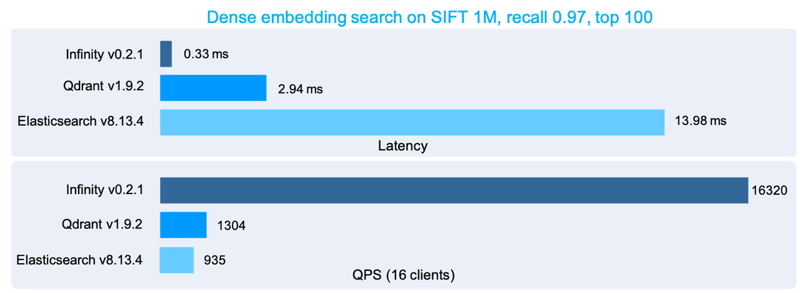
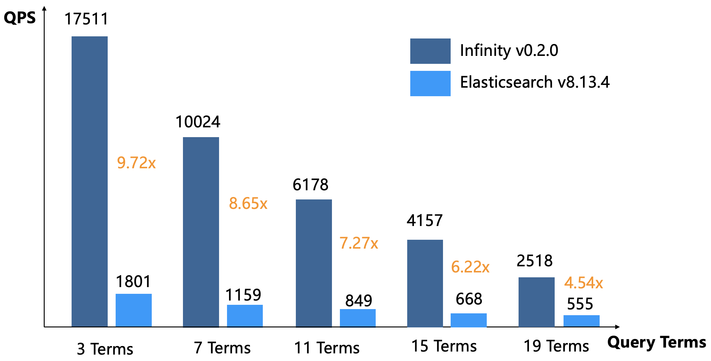

Infinity v0.2 was released, offering the most comprehensive and fastest multi-way retrieval in the industry. This blog post explains how Infinity achieves this.

Infinity is a database with sophisticated designs at both storage engine and execution engine levels. The following diagram illustrates the workflow of Infinity's execution engine: after binding the API queries, the execution plan is compiled into a pipeline execution plan. This mechanism differs from those commonly seen in modern data warehouses. Pipelines in data warehouses are designed mainly for parallel query execution; Infinity's pipeline serves both parallel querying and concurrent query execution to optimize scheduling strategies and CPU affinity for query operators during high-concurrency execution, and avoid overhead caused by invalid context switches. This optimization in design translates to reduced end-to-end query overhead and an overall query latency comparable to latencies running a single retrieval library.<!--truncate--> 

On the right side of the diagram above is a multi-way retrieval example, which includes two parallel vector search execution operators, each running on a segment, a Top-K merge KNN operator for merging the vector search results from the two segments, a full-text search operator, and a final fusion operator for merging the retrieval results from the two paths. These operators together form a Directed Acyclic Graph (DAG) in the memory, and the query executor is responsible for runtime scheduling.

Regarding the storage engine, Infinity implements a comprehensive column-based indexing system. Each retrieval path has a corresponding index responsible for high-performance retrieval, facilitating the addition of new data types to Infinity.

Now, let's take a look at how Infinity's indexing is implemented. Like many vector databases, Infinity uses HNSW as the default vector index. However, Infinity's HNSW implementation has undergone a series of in-depth optimizations. Specifically, it incorporates locally adaptive quantization for each vector to be indexed, which is also known as local vector quantization (LVQ). By scaling and quantizing each vector, this compression technique has drastically accelerated similarity computations, reduced bandwidth consumption, and decreased memory footprint, without significantly impacting search accuracy. 

Further, Infinity applies two-stage quantization to each vector: The first-stage quantization encodes the difference between each vector and the mean of all vectors, primarily facilitating HNSW graph traversal.  This reduces memory bandwidth consumption and boosts search performance by compressing vectors. The second-stage quantization quantizes the residuals of these differences to improve query accuracy in the final similarity comparison. LVQ quantizes each vector without altering the nearest neighbor relations between vectors. This, coupled with its random memory access pattern, makes it particularly suitable for graph-based similarity searches. The HNSW index implemented in Infinity is built solely on the results of the first-level quantization, resulting in significantly better query performance and much lower memory usage than traditional HNSW indexes. In addition to LVQ, Infinity extensively uses SIMD acceleration for distance calculations. These design choices enable Infinity to outperform many of its peer vector databases in terms of vector search performance. The following illustration compares Infinity's performance benchmarks with those of other mainstream vector databases:

Infinity does not introduce popular full-text indexing libraries like Tantivy and Lucene, opting instead to build its own full-text index from scratch. This is because, as a component inside Infinity, the full-text index in Infinity needs to work seamlessly with its storage engine and the execution engine. This is evident in several aspects:

1. A full-text index in Infinity must facilitate real-time data ingestion.
2. A full-text index involves inverted and forward indexes. The forward index overlaps the database in functionalities, so simply patching them together would create undesirable redundancies.
3. A full-text index in Infinity is involved in fused reranking with other indexes, requiring its logic to align with that of the execution engine.

In addition, Infinity is a database designed specifically for RAG scenarios. It is required to search for answers based on typically lengthy user queries. In such cases, "OR" semantics should be used between query keywords instead of "AND" to avoid zero recall. However, "OR" semantics would significantly degrade the search performance, as all results matching any keyword are scored and included in the final ranking. Consequently, a full-text index requires the implementation of dynamic query pruning techniques to reduce undesired scoring and ranking. 

The best dynamic query pruning solutions in academia over the past decade are exemplified by techniques like WAND and MaxScore. While full-text search is a relatively mature field, only a few full-text indexing libraries, such as Lucene and Tantivy, offer production-level algorithm implementations. Infinity has fully implemented both Block Max WAND (Reference [1]) and Block Max MaxScore, each targeting slightly different scenarios, with Block Max WAND being the default pruning strategy.

WAND, short for Weak AND, uses BM25, the most common scoring method in full-text search, to dynamically prune user queries. It estimates the upper limit of the final Top K results by calculating the maximum contribution of each keyword, and uses this as a threshold to efficiently skip unwanted document IDs in the inverted index, thereby accelerating full-text search. The upper limit of each keyword's contribution is determined by its IDF (Inverse Document Frequency, or in how many documents it appears) and maximum TF (Term Frequency) in the document.

The above diagram shows a performance comparison of full-text search between Infinity and Elasticsearch, with the testing method outlined as follows:

1. The dataset is wikipedia 33M, with a size of 32GB.
2. Generate a word list from the dataset according to term frequency, then randomly select keywords from it based on IDF term frequency distribution to generate queries. The query lengths range from three to 19 terms, with the generated query files available [here](https://github.com/infiniflow/benchmark/tree/main/enwiki_queries). Both Infinity and Elasticsearch use default Top-K Union semantics (OR) for querying.
3. Both Infinity and Elasticsearch are given a certain warmup period to cache the indexed data in the operating system's page cache.

Infinity surpasses Elasticsearch overwhelmingly in either long or short query performance, whilst using only half the memory during testing.

Previously, Elasticsearch (including Opensearch) was the sole option for hybrid search in RAG. Now, Infinity not only expands these options but also significantly outperforms Elasticsearch as well as offering enhanced multi-way retrieval capabilities.

Similar to full-text search, Infinity's sparse vector index employs inverted indexing and dynamic query pruning. However, sparse vectors in Infinity are initially organized into forward indexes by block, with the inverted index holding block-specific information only. A sparse vector search in Infinity jumps from block to block and performs similarity calculations using the forward index. Thus, Infinity's sparse vector index is not a standard inverted index, but a hybrid index combining block-based inverted index with forward index. 

The graph below compares the performance (latency and QPS) of Infinity and the renowned vector database Qdrant in sparse vector search:

Infinity demonstrates top performance in dense vector, sparse vector, and full-text searches. Coupled with its robust multi-way retrieval capabilities and various rerankers, particularly tensor-based ones, Infinity stands out as the fastest and most powerful database designed for RAG so far.

Infinity is evolving rapidly. We invite you to follow, star, and actively contribute to our project. Visit our GitHub repository at https://github.com/infiniflow/infinity

## Bibligraphy

1. Ding, Shuai and Suel, Torsten. Faster top-k document retrieval using block-max indexes. SIGIR 2011

